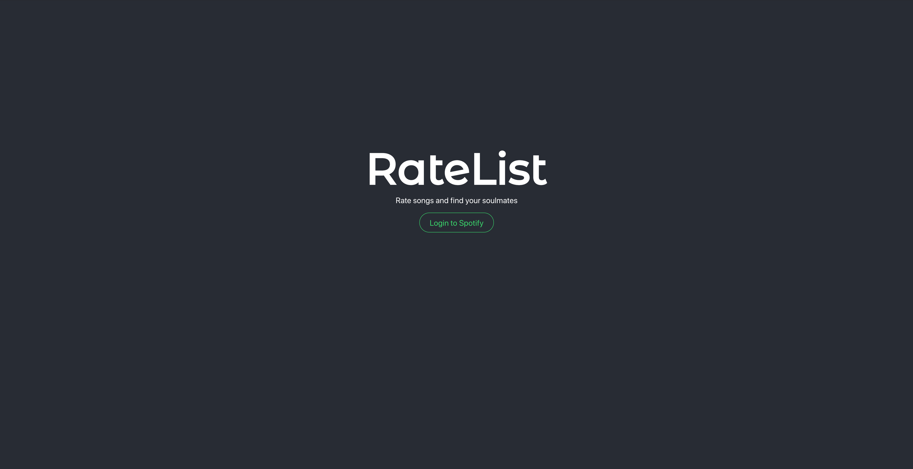
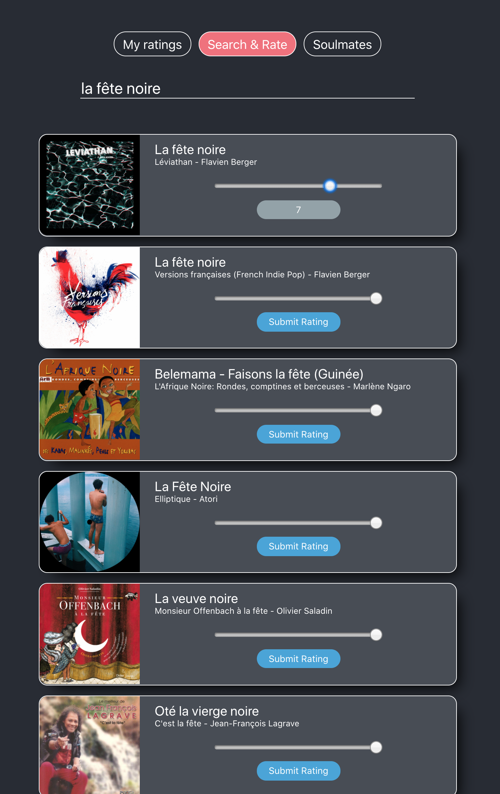
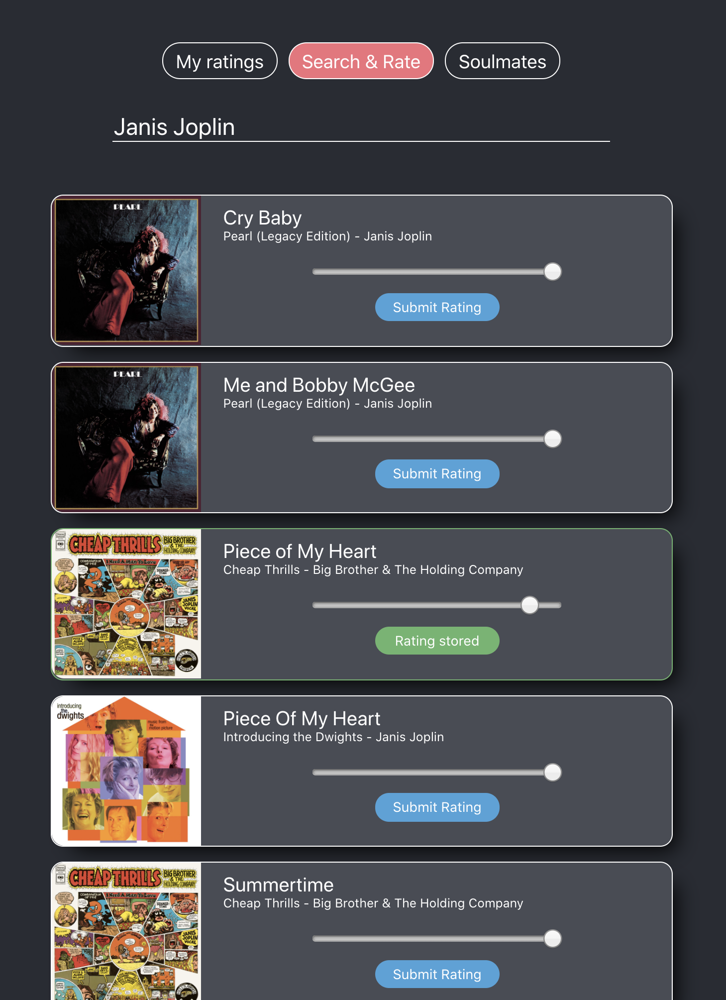
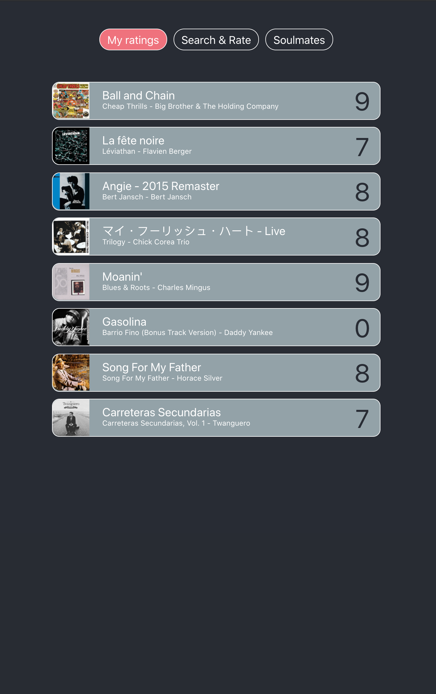

# Ratelist

  

    
  

  

    
    
    
  

## What is Ratelist?

Ratelist allows you to search songs in Spotify API and rate them. Built in a week.
More features will be added soon. Stay tuned! 

## Tech stack

The app is built in React on the front-end, and the back-end is powered by Node.js, Express.js, Sequelize and PostgreSQL. Authorisation is implemented with Passport.js.

